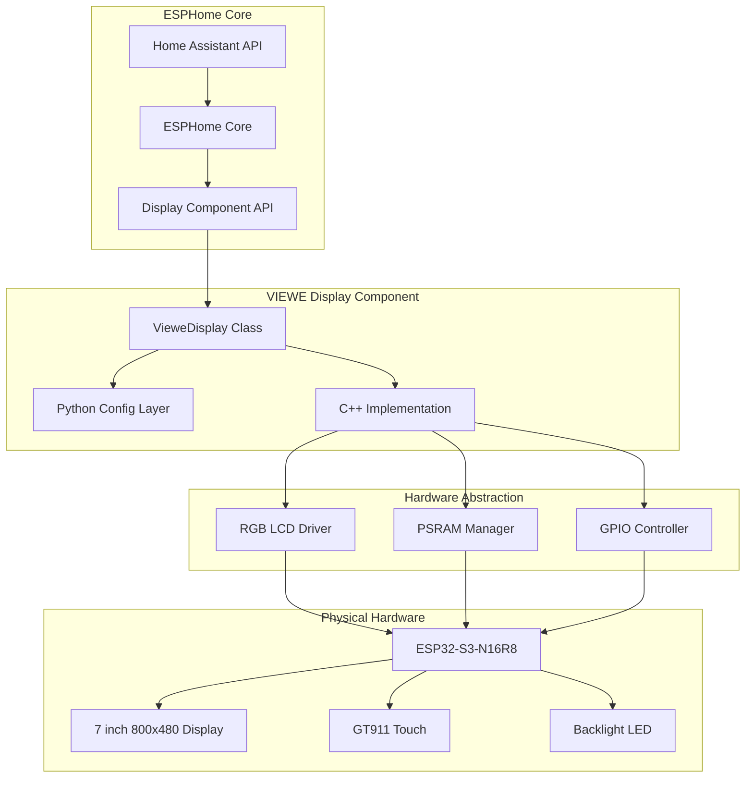
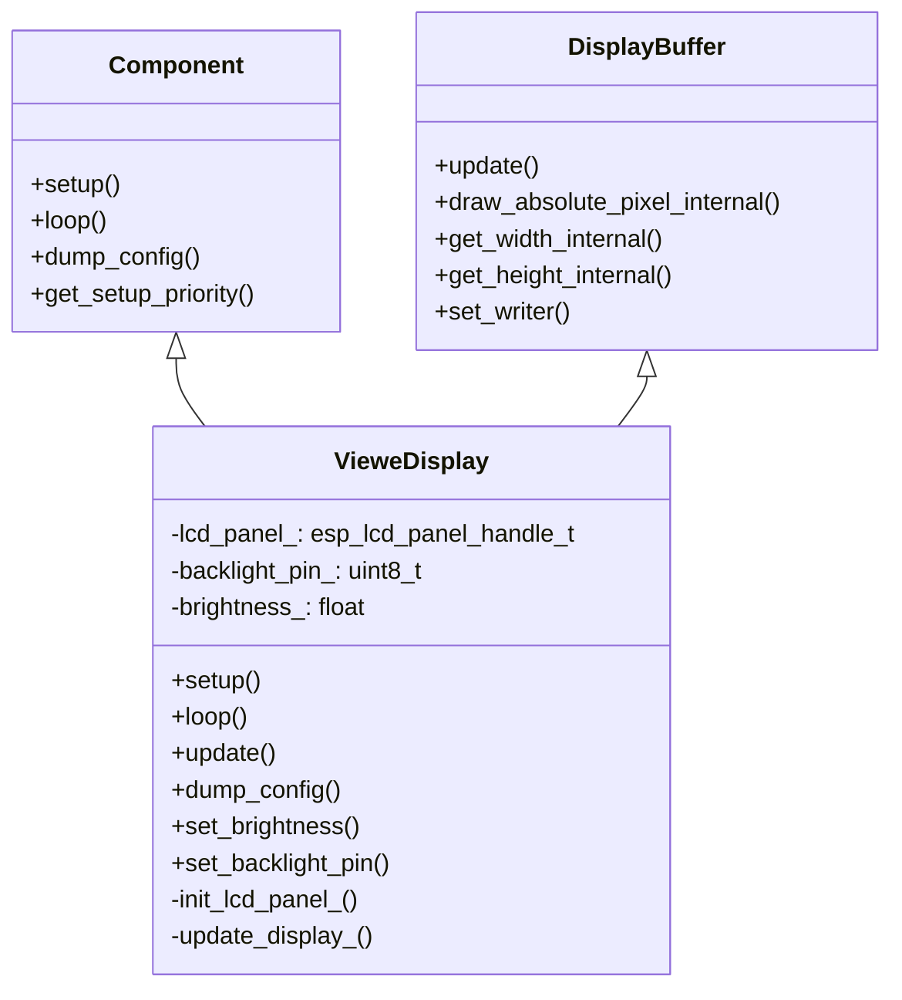
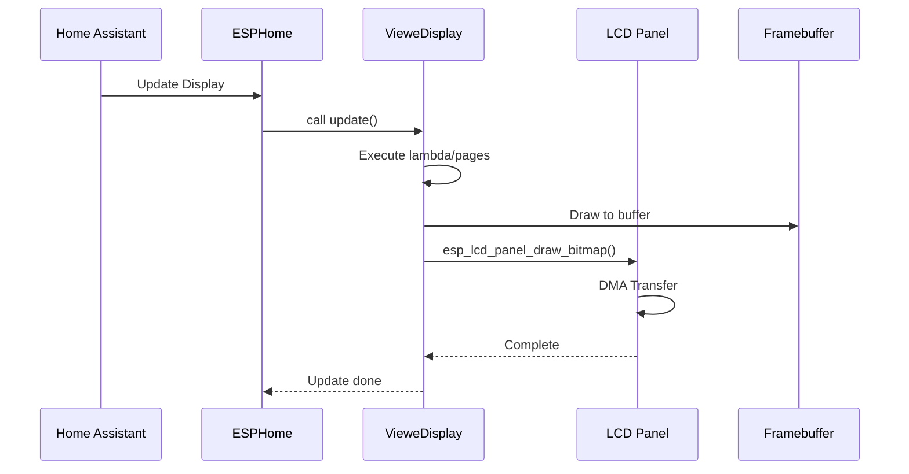
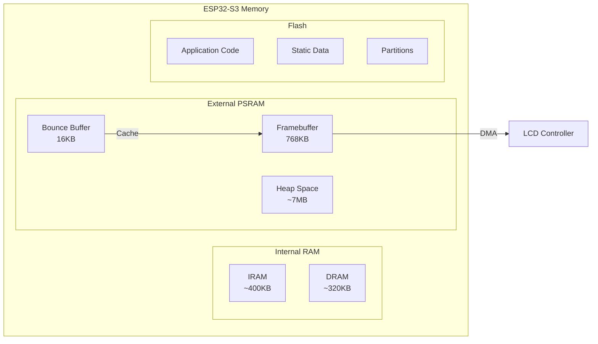
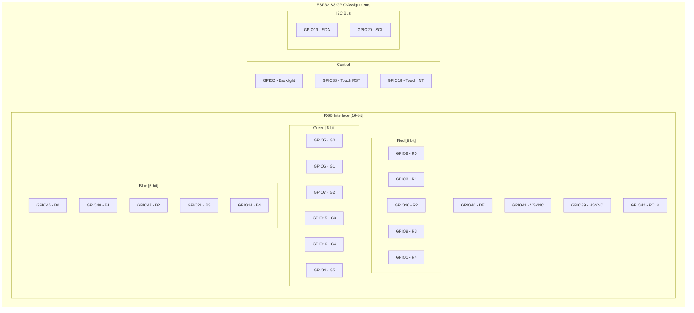
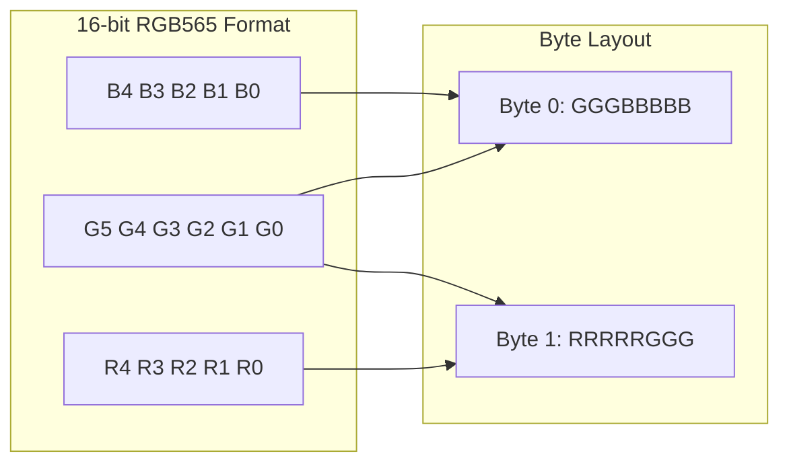
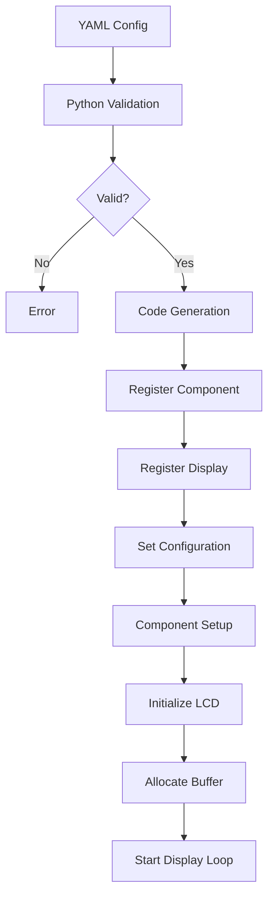

# VIEWE Display Component Architecture

## Overview

This document describes the architecture and implementation of the ESPHome custom component for the VIEWE UEDX80480070E-WB-A 7-inch display with ESP32-S3. The component provides native RGB565 display driver support with hardware acceleration, PSRAM framebuffer management, and full integration with ESPHome's display API.

## Table of Contents

1. [System Architecture](#system-architecture)
2. [Hardware Specifications](#hardware-specifications)
3. [Component Structure](#component-structure)
4. [Implementation Details](#implementation-details)
5. [Security Features](#security-features)
6. [Performance Optimizations](#performance-optimizations)
7. [API Reference](#api-reference)
8. [Development Timeline](#development-timeline)

## System Architecture



## Component Structure

### File Organization

```
components/viewe_display/
├── __init__.py          # Component registration and validation
├── display.py           # Configuration schema and code generation
├── viewe_display.h      # C++ header with class definition
└── viewe_display.cpp    # C++ implementation
```

### Class Hierarchy



## Data Flow



## Memory Architecture



### Memory Allocation

- **Framebuffer**: 800 × 480 × 2 bytes = 768KB (allocated in PSRAM)
- **Bounce Buffer**: 800 × 10 × 2 bytes = 16KB (for DMA optimization)
- **Total PSRAM**: 8MB (plenty of headroom for LVGL and app data)

## Pin Mapping



## Display Timing

The display uses specific timing parameters for proper synchronization:

```mermaid
gantt
    title Display Timing (One Frame)
    dateFormat X
    axisFormat %L
    
    section Vertical
    VSync Pulse     :0, 6
    Back Porch      :6, 32
    Active Display  :32, 512
    Front Porch     :512, 542
    
    section Horizontal
    HSync Pulse     :0, 48
    Back Porch      :48, 88
    Active Display  :88, 888
    Front Porch     :888, 976
```



### Timing Parameters
- **Pixel Clock**: 15 MHz
- **Frame Rate**: ~31 FPS
- **Horizontal**: 800 pixels + 176 blanking = 976 total
- **Vertical**: 480 lines + 62 blanking = 542 total

## Color Format (RGB565)



## Configuration Flow



## ESPHome Integration Points

### 1. Component Registration
- Inherits from `Component` for lifecycle management
- Inherits from `DisplayBuffer` for drawing API
- Registered with proper setup priority (`HARDWARE`)

### 2. Configuration Schema
- Full integration with ESPHome's display schema
- Support for lambdas and pages
- Validation of pin assignments and parameters

### 3. Drawing API
- Implements `draw_absolute_pixel_internal()` for pixel-level control
- Supports all DisplayBuffer drawing methods
- Color conversion through `ColorUtil::color_to_565()`

### 4. Update Cycle
- Called periodically via `update()` method
- Double buffering managed by ESP-IDF
- DMA transfers handled by hardware

## Performance Optimizations

1. **PSRAM Usage**: Framebuffer in external RAM to free internal memory
2. **Bounce Buffer**: 10-line buffer for efficient DMA transfers
3. **Hardware Acceleration**: RGB peripheral with DMA
4. **Compiler Optimizations**: Using ESP-IDF optimized functions

## Compliance with ESPHome Standards

### Code Style
- ✅ Snake_case for functions and variables
- ✅ CamelCase for classes
- ✅ UPPER_CASE for constants
- ✅ Proper namespace usage (`esphome::viewe_display`)

### Component Requirements
- ✅ Non-blocking operations
- ✅ Proper error handling with `mark_failed()`
- ✅ Configuration validation
- ✅ Comprehensive logging with `ESP_LOGCONFIG`

### Python Standards
- ✅ Configuration constants defined
- ✅ Async code generation
- ✅ Proper schema validation
- ✅ Component dependencies declared

## Future Enhancements

1. **PWM Brightness Control**: Replace binary backlight with PWM
2. **Rotation Support**: Add 90/180/270 degree rotation
3. **Touch Integration**: Direct touch event handling in component
4. **Power Management**: Sleep modes and wake-on-touch
5. **Dynamic Pin Configuration**: Make pins configurable via YAML

## Testing Considerations

### Unit Testing
- Verify buffer allocation and management
- Test color conversion accuracy
- Validate timing parameters

### Integration Testing
- Test with various LVGL widgets
- Verify Home Assistant integration
- Test OTA updates with display active

### Performance Testing
- Measure actual frame rates
- Monitor memory usage
- Check DMA transfer efficiency

## Troubleshooting Guide

### Common Issues

1. **Display Not Working**
   - Check ESP-IDF version (requires 5.1+)
   - Verify PSRAM enabled in sdkconfig
   - Confirm power supply adequate (5V/1A)

2. **Graphics Artifacts**
   - Adjust timing parameters
   - Check PSRAM configuration
   - Reduce update frequency

3. **Touch Not Responding**
   - Verify I2C bus configuration
   - Check pull-up resistors (4.7kΩ)
   - Confirm INT pin connection

## References

- [ESP32-S3 Technical Reference](https://www.espressif.com/sites/default/files/documentation/esp32-s3_technical_reference_manual_en.pdf)
- [ESP-IDF LCD Documentation](https://docs.espressif.com/projects/esp-idf/en/latest/esp32s3/api-reference/peripherals/lcd.html)
- [ESPHome Display Component](https://esphome.io/components/display/index.html)
- [LVGL Documentation](https://docs.lvgl.io/8.3/)